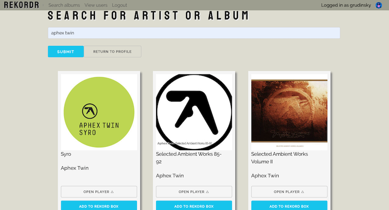

# Project 2: Rekordr

## Overview 

Rekordr is an online web application for storing and browsing user record collections.
It was built together with [MattPRW](https://github.com/MattPRW) & [tommuxworthy](https://github.com/tommuxworthy) over a 8 day group project period and was the third project during my course at General Assembly.
My role in this project mainly included but was not limited to the following tasks:
Implementing backend Axios requests to the third party music database and creating the Album model in MongoDB from third party DB search results and linking those to User model, creating the custom player React Component to play album song previews, create reusable form that could be used for register, login and user data editing depending on entry fields needed for the task.


---
## Technologies Used

* HTML5
* SCSS and Bulma CSS framework
* JavaScript
* MongoDB
* Express
* React.js
* Node
* Insomnia
* Mocha & Chai Testing
* Axios
* [Deezer API](https://developers.deezer.com/api)
* Git/GitHub

---
## Deployment

Web version can be found on [Heroku](https://rekordr.herokuapp.com/)

---
## Getting Started

Clone the repository and run on your machine. 

Install the packages listed in the package.json file by running the following terminal command:

$ npm i

Run the app on with the following command:

$ npm run start

Start your browser and navigate to following address:

http://localhost:4000/

---
## Usage

This application allows user to perform the following actions:
* Login. Login, register and profile edit uses the same React component with different props passed to it.

* Register

* View own profile

* Edit own Profile

* Search for music albums. Album search is being performed in [Deezer API](https://developers.deezer.com/api) database.

* Add any album to own record collection.

* Remove albums from own collection. Once the user is back to his own profile page, he can remove any previously added albums from it.

* Play album preview from search, own profile and other user pages. More on this function in the next section.

* View other user profiles and add their albums to own collection.


---
## Approach Taken

Below are the main challenges that I have faced while working on this project. Both of them are related to handling the individual album features on the back-end and front-end side.

### Back-end: implementing the create route for the Album Model

Since our albums are created from the external DB data, i came up with the following logic to create the instanc eof the album in our database. Once the "add to rekordbox" button is clicked, app performs a search for this album in local database and depending on the outcome, creates a new album instance and attaches user to it or attaches the user to already existing album if it has been created by another user. In the process we also change he id field from external database to "deezerID" in order to avoid two fields with "id" category once the MongoDB entryis populated.

```
function create(req, res) { // grabs album from Deezer DB if only it does not exist in local DB. Once created it adds the user to users array.
  !req.body.deezerId && (req.body.deezerId = req.body.id) //rewrites deezer object data to our model format
  !req.body.coverImage && (req.body.coverImage = req.body.cover_medium)//rewrites deezer object data to our model format
  Album
    .findOne({ deezerId: req.body.deezerId })
    .then(album => {
      if (!album) return Album.create(req.body)
      return album
    })
    .then(album => {
      if (album.users.includes(req.currentUser._id)) return album.save()
      album.users.push(req.currentUser)
      return album.save()
    })
    .then(album => res.status(201).json(album))
    .catch(err => res.json(err.message))
}
```

### Front-end: engineering the multifunctional album card

On the front-end my idea was to display all the necessary album data and have all the album features on the album card. At the end we ended up with the Album Card React component that does the following:
Add to rekordbox - pushes the user to existing album.users array.
Remove from rekordbox - removes the user from existing album.users array. Both above functions reuse the same button based on the ternary operator function that checks if the album has the user details in its album.users array.
Open Player and Close player - loads and unloads the album details to the top-level component state(handleToggleDropDown(e) function). At this stage it also performs a get request to get the album tracklist with individual song paths(getTracks(arg) function).
Displays the songs on top of the album cobver image and plays the chosen song on [React H5 Audio Player](https://www.npmjs.com/package/react-h5-audio-player) (handlePlayer(e) function from below snippet).

```
 // music player functions

  handleToggleDropDown(e) {
    this.state.albumOnPlayer !== parseInt(e.target.value) ? this.setState({ albumOnPlayer: parseInt(e.target.value) }, this.getTracks(e.target.value)) : this.setState({ albumOnPlayer: 0 })
  }

  getTracks(arg) {
    axios.get(`/api/proxyrequest/albumtracks/${arg}`)
      .then(res => this.setState({ albumTracks: res.data.data }))
      .catch(err => console.log(err))
  }

  handlePlay(e) {
    this.setState({ songOnPlayer: e.target.id })
  }
  ```

Below is the final result of album component:


---
## Future Improvements

In order to have the more function al app, there are some improvements that could be added to this in the future:

* To add the suggestions  section for the albums that other users with similar music tastes and records in common have. Currently the results page for other app users displays only number of abums in common with the logged in user.
